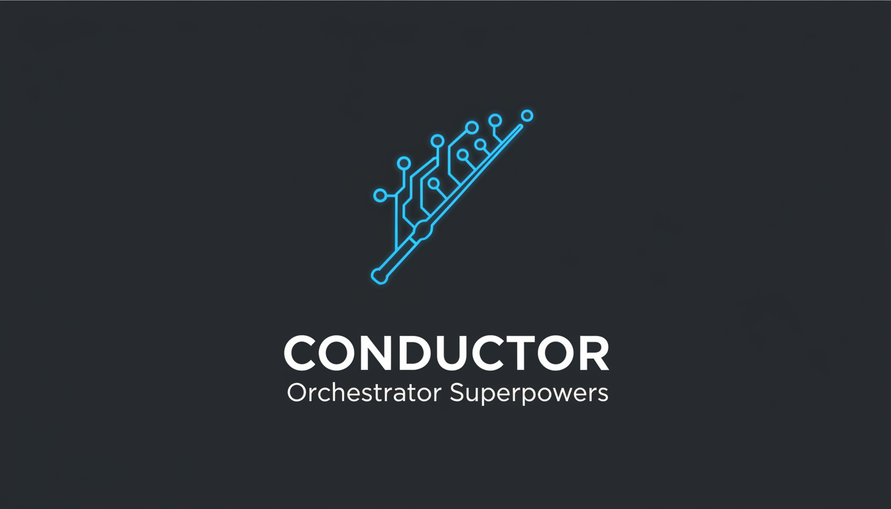
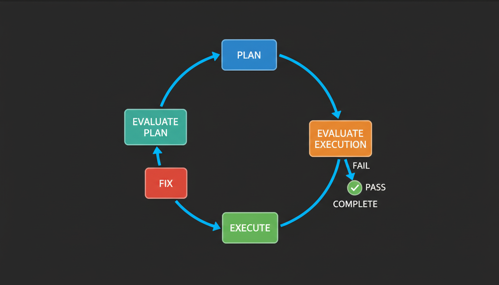
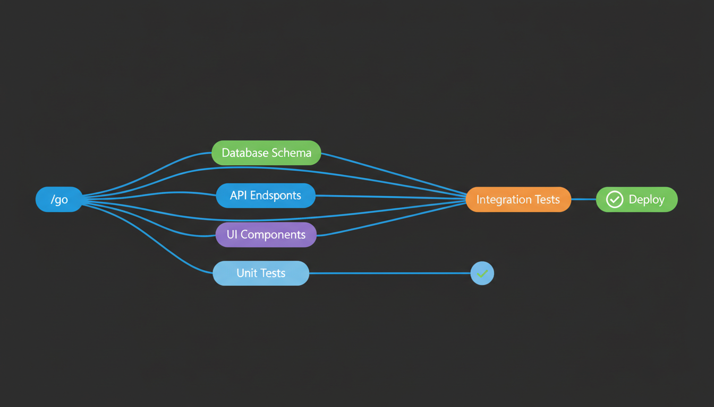
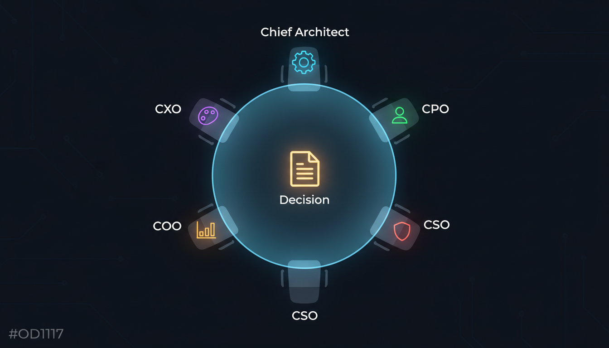

<p align="center">
  
</p>

# SupaConductor (formerly conductor-orchestrator-superpowers)

> ⚠️ **CRITICAL: PLUGIN RENAMED TO SUPACONDUCTOR**
> This plugin has been renamed from `conductor-orchestrator-superpowers` to `supaconductor`.
> **Existing users MUST follow the [Migration Guide](#migration-guide-from-conductor-orchestrator-superpowers) below to avoid command failures.**

<p align="center">
  <strong>Multi-agent orchestration for Claude Code</strong><br/>
  Parallel execution &bull; Automated quality gates &bull; Board of Directors
</p>

<p align="center">
  <strong>Multi-agent orchestration for Claude Code</strong><br/>
  Parallel execution &bull; Automated quality gates &bull; Board of Directors
</p>

<p align="center">
  <a href="https://github.com/Ibrahim-3d/conductor-orchestrator-supaconductor/blob/main/LICENSE"></a>
  <a href="https://github.com/Ibrahim-3d/conductor-orchestrator-supaconductor"></a>
  <a href="https://docs.anthropic.com/en/docs/claude-code"></a>
  <a href="https://github.com/obra/superpowers"></a>
</p>

<p align="center">
  <a href="#installation">Installation</a> &bull;
  <a href="#quick-start">Quick Start</a> &bull;
  <a href="#the-evaluate-loop">How It Works</a> &bull;
  <a href="#commands">Commands</a> &bull;
  <a href="#architecture">Architecture</a> &bull;
  <a href="#license">License</a>
</p>

## Migration Guide (from conductor-orchestrator-superpowers)

If you have the old `conductor-orchestrator-superpowers` plugin installed, you **must** perform these steps to migrate to SupaConductor:

1.  **Uninstall old plugin**: Run `/plugin` in Claude Code, find `conductor-orchestrator-superpowers`, and disable/remove it.
2.  **Delete old directory**: Manually delete `~/.claude/plugins/conductor-orchestrator-superpowers` (or wherever you cloned it).
3.  **Install SupaConductor**: Follow the [Installation](#installation) instructions above.
4.  **Update existing projects**: If you have active Conductor tracks, run `/supaconductor:setup` in those projects to update the internal references.

**Why the change?** We renamed from `conductor-orchestrator-superpowers` to `supaconductor` because the old name was too long and causing path-length issues in some environments. All your existing tracks and data are safe, but the *commands* you use to interact with them have changed to the `/supaconductor:` namespace.

---

## What is this?

Conductor turns Claude Code into a **structured engineering team**. Instead of ad-hoc coding, it organizes work into tracks with specs, plans, parallel execution, and automated evaluation.

**One command. Full automation.**

```bash
/supaconductor:go Add user authentication with OAuth
```

That single command triggers the full lifecycle — spec, plan, execute, evaluate, fix — without any manual handoffs.

## What's Included

| Component | Count | Highlights |
|-----------|------:|------------|
| **Agents** | 16 | Orchestrator, loop agents, board directors, executive advisors, workers |
| **Skills** | 42 | Planning, execution, evaluation, debugging, TDD, code review |
| **Commands** | 22 | `/supaconductor:go`, `/supaconductor:setup`, `/supaconductor:board-meeting`, `/supaconductor:cto-advisor`, and more |
| **Evaluators** | 4 | UI/UX, Code Quality, Integration, Business Logic |
| **Board of Directors** | 5 | Chief Architect, CPO, CSO, COO, CXO |
| **Lead Engineers** | 4 | Architecture, Product, Tech, QA |

Bundles [superpowers](https://github.com/obra/superpowers) v4.3.0 (MIT) — no external dependencies.

---

## Installation

### Option 1: Plugin Marketplace (easiest)

```bash
/plugin marketplace add Ibrahim-3d/conductor-orchestrator-supaconductor
/plugin install conductor-orchestrator-supaconductor@ibrahim-plugins
```

### Option 2: Clone directly

```bash
git clone https://github.com/Ibrahim-3d/conductor-orchestrator-supaconductor.git ~/.claude/plugins/conductor-orchestrator-supaconductor
```

### Option 3: Manual download

Download the latest release and extract to `~/.claude/plugins/conductor-orchestrator-supaconductor/`.

### Verify

Start a new Claude Code session. Type `/` and check for `/supaconductor:go`, `/supaconductor:implement`, `/supaconductor:board-meeting` in the command list.

---

## Quick Start

**1. Initialize Conductor in your project:**

```bash
/supaconductor:setup
```

Creates a `conductor/` directory with track registry, workflow docs, and knowledge base.

**2. Build something:**

```bash
/supaconductor:go Add Stripe payment integration with webhooks
/supaconductor:go Fix the login bug where users get logged out after refresh
/supaconductor:go Build a dashboard with real-time analytics charts
/supaconductor:go Refactor the database layer to use connection pooling
```

**3. Monitor and control:**

```bash
/supaconductor:status          # See all tracks and progress
/supaconductor:implement       # Continue work on current track
/supaconductor:new-track       # Create a track manually
/supaconductor:phase-review              # Run quality gate evaluation
```

---

## The Evaluate-Loop

Every track follows a rigorous, automated cycle:

<p align="center">
  
</p>

| Step | What Happens |
|------|-------------|
| **Plan** | Generates implementation steps with dependency graph (DAG) |
| **Evaluate Plan** | Checks scope, overlap with existing tracks, feasibility |
| **Execute** | Implements code, runs tests, updates progress |
| **Evaluate Execution** | Dispatches specialized evaluators (UI/UX, code quality, integration, business logic) |
| **Fix** | Addresses failures, loops back to evaluation (max 3 cycles) |
| **Complete** | All evaluators pass — track marked done |
| **Retrospective** | Extracts reusable patterns and error fixes to knowledge layer |

The loop runs **fully automated**. It stops when the track is complete, when the fix cycle exceeds 3 iterations, or when it needs human input.

---

## Parallel Execution

Tasks without dependencies run simultaneously via DAG scheduling:

<p align="center">
  
</p>

The orchestrator reads the dependency graph and dispatches independent tasks to parallel worker agents. When all upstream dependencies resolve, downstream tasks start automatically.

---

## Board of Directors

For major architectural and strategic decisions, a 5-member board deliberates across 5 phases:

<p align="center">
  
</p>

| Director | Domain | Focus |
|----------|--------|-------|
| **Chief Architect** | Technical | System design, patterns, scalability, tech debt |
| **Chief Product Officer** | Product | User value, market fit, scope discipline |
| **Chief Security Officer** | Security | Vulnerabilities, compliance, data protection |
| **Chief Operations Officer** | Operations | Feasibility, timeline, resources, deployment |
| **Chief Experience Officer** | Experience | UX/UI, accessibility, user journey |

Each director independently assesses, then they discuss and vote with written rationale.

```bash
/supaconductor:board-meeting Should we migrate from REST to GraphQL?
/supaconductor:board-review Add real-time notifications via WebSocket
```

---

## Commands

### Core

| Command | Description |
|---------|-------------|
| `/supaconductor:go <goal>` | State your goal — Conductor handles everything |
| `/supaconductor:status` | View all tracks and current progress |
| `/supaconductor:implement` | Run the Evaluate-Loop on current track |
| `/supaconductor:new-track` | Create a new track with spec and plan |
| `/supaconductor:setup` | Initialize Conductor in a project |

### Quality & Review

| Command | Description |
|---------|-------------|
| `/supaconductor:phase-review` | Post-execution quality gate |
| `/supaconductor:cto-advisor` | CTO-level architecture review |
| `/supaconductor:board-meeting <topic>` | Full board deliberation (4 phases) |
| `/supaconductor:board-review <topic>` | Quick board assessment |
| `/supaconductor:ui-audit` | UI/UX accessibility audit |

### Advisors

| Command | Description |
|---------|-------------|
| `/supaconductor:ceo` | Strategic business advice |
| `/supaconductor:cmo` | Marketing strategy guidance |
| `/supaconductor:cto` | Technical architecture guidance |
| `/supaconductor:ux-designer` | UX strategy and design guidance |

### Superpowers (Bundled)

| Command | Description |
|---------|-------------|
| `/supaconductor:writing-plans` | Create a plan using superpowers patterns |
| `/supaconductor:executing-plans` | Execute a plan using superpowers patterns |
| `/supaconductor:brainstorm` | Creative problem-solving session |

---

## Architecture

### How the pieces fit together

```
┌─────────────────────────────────────────────────────────────┐
│                    /go <your goal>                           │
│                         │                                   │
│              ┌──────────▼──────────┐                        │
│              │    Orchestrator     │  conductor-orchestrator │
│              │  (master loop)      │                        │
│              └──────────┬──────────┘                        │
│                         │                                   │
│    ┌────────────────────┼────────────────────┐              │
│    ▼                    ▼                    ▼              │
│ ┌──────┐         ┌──────────┐         ┌──────────┐         │
│ │ Plan │ ──────▶ │ Execute  │ ──────▶ │ Evaluate │         │
│ └──────┘         └──────────┘         └──────────┘         │
│    │                    │                    │              │
│    ▼                    ▼                    ▼              │
│ writing-plans   parallel-dispatcher   4 evaluators          │
│ plan-evaluator   ├─ task-worker       ├─ eval-ui-ux        │
│ cto-reviewer     ├─ task-worker       ├─ eval-code-quality  │
│                  └─ task-worker       ├─ eval-integration   │
│                                       └─ eval-business      │
│                                                             │
│  ┌──────────────────────┐  ┌─────────────────────────────┐  │
│  │  Board of Directors  │  │  Knowledge / Retrospective  │  │
│  │  5 directors + vote  │  │  patterns.md + errors.json  │  │
│  └──────────────────────┘  └─────────────────────────────┘  │
└─────────────────────────────────────────────────────────────┘
```

### Plugin directory structure

```
conductor-orchestrator-supaconductor/
├── .claude-plugin/
│   └── plugin.json              # Plugin manifest
├── assets/                      # Diagrams and images
├── agents/                      # 16 agent definitions
│   ├── conductor-orchestrator.md
│   ├── loop-planner.md
│   ├── loop-executor.md
│   ├── loop-fixer.md
│   ├── loop-plan-evaluator.md
│   ├── loop-execution-evaluator.md
│   ├── board-meeting.md
│   ├── code-reviewer.md
│   ├── parallel-dispatcher.md
│   ├── task-worker.md
│   └── ...                      # Executive advisors
├── commands/                    # 22 slash commands
├── skills/                      # 42 skills
│   ├── conductor-orchestrator/  # Core loop orchestration
│   ├── writing-plans/           # Plan creation (superpowers)
│   ├── executing-plans/         # Plan execution (superpowers)
│   ├── systematic-debugging/    # Debugging (superpowers)
│   ├── eval-ui-ux/             # UI/UX evaluator
│   ├── eval-code-quality/      # Code quality evaluator
│   ├── eval-integration/       # Integration evaluator
│   ├── eval-business-logic/    # Business logic evaluator
│   ├── board-of-directors/     # Board deliberation system
│   │   └── directors/          # 5 director profiles
│   ├── leads/                  # 4 lead engineer roles
│   ├── parallel-dispatch/      # DAG-based parallel execution
│   ├── message-bus/            # Inter-agent communication
│   └── ...                     # 25+ more skills
├── hooks/                       # Session hooks
├── lib/                         # Utility scripts
├── docs/                        # Workflow, authority, and protocol docs
├── scripts/                     # Setup script
└── LICENSES/                    # Third-party license files
```

### Track structure (created per project)

When you run `/supaconductor:setup`, it creates:

```
your-project/
└── conductor/
    ├── tracks.md               # Track registry
    ├── workflow.md             # Process documentation
    ├── authority-matrix.md     # Decision boundaries
    ├── decision-log.md         # Architectural decisions
    ├── knowledge/
    │   ├── patterns.md         # Learned patterns
    │   └── errors.json         # Error-fix registry
    └── tracks/
        └── feature-name/
            ├── spec.md         # Requirements
            ├── plan.md         # Implementation plan + DAG
            └── metadata.json   # State machine + config
```

---

## Project-Specific Skills

Conductor handles orchestration. Your project handles domain knowledge. Keep project-specific skills in `${CLAUDE_PLUGIN_ROOT}/skills/`:

```
your-project/${CLAUDE_PLUGIN_ROOT}/skills/
├── product-rules/SKILL.md       # Business logic, personas
├── api-patterns/SKILL.md        # API conventions
├── design-system/SKILL.md       # Design tokens, components
└── testing-standards/SKILL.md   # Coverage targets, test patterns
```

The orchestrator loads both plugin skills and project skills automatically.

---

## FAQ

### How much context does this plugin use?

Skills use **progressive disclosure** — only ~100 tokens per skill for metadata scanning. Full instructions load only when a skill activates (typically <5k tokens each). In practice, a `/go` session loads the orchestrator skill (~4k tokens) plus whichever evaluator/planner is active at that step. Inactive skills stay dormant. The 42 skills are **not** all loaded at once.

Commands (slash commands) add zero context until invoked. Agents run as **subprocesses with their own context windows**, so they don't consume your main conversation's context.

**Estimated overhead per step:**

| Step | Context Added | Notes |
|------|--------------|-------|
| Orchestrator | ~4k tokens | Always active during `/go` |
| Planner | ~3k tokens | Active during planning only |
| Evaluator | ~2-3k tokens each | Only active evaluator loads |
| Board meeting | ~5k tokens | On-demand, not part of default loop |
| Idle (between steps) | ~500 tokens | Metadata only |

### Does this work with Gemini CLI, Trae, Cursor, or other AI tools?

**Short answer:** No. This is a Claude Code plugin that uses Claude Code's plugin system (agents, skills, slash commands, hooks). It cannot run in Gemini CLI, Trae, Cursor, Windsurf, or other tools — they have different architectures and APIs.

**However**, the underlying concepts are portable:
- The `conductor/` directory it creates in your project (specs, plans, track registry) is just Markdown files. Any AI tool can read_file them.
- If you start a project with Conductor and later switch tools, your specs and plans remain useful documentation.
- The Evaluate-Loop pattern (plan → evaluate → execute → evaluate → fix) is a workflow methodology, not locked to any runtime.

### What does this cost in API credits?

Conductor uses the same Claude API calls you'd make manually — it just structures them. Multi-agent orchestration does mean **more API calls** because:
- Each agent subprocess is a separate conversation
- Evaluation steps add calls you might skip manually
- Board meetings use 5+ parallel agent calls

**Rough multiplier:** A `/go` session for a medium feature uses roughly **3-5x** the API calls of doing it manually. You're trading credits for structure, quality gates, and reduced rework.

**Ways to reduce cost:**
- Use `/supaconductor:implement` (skips spec generation if you write_file your own)
- Skip board meetings for small features (they're opt-in via `/board-meeting`)
- Use Sonnet or Haiku for the model where possible (agent model selection respects your Claude Code config)

### Which Claude models does this work with?

All of them. The plugin works with whatever model you've configured in Claude Code (Opus, Sonnet, Haiku). Agents inherit the parent model by default, but the orchestrator can dispatch to specific models when appropriate (e.g., Haiku for simple tasks, Opus for complex evaluation).

### Is this overkill for small projects?

For a one-file script or a quick fix — yes, skip it. Use Conductor when:
- The feature touches 3+ files
- You'd normally spend time planning before coding
- You want automated quality checks before shipping
- You're building something that needs to be right the first time

You can also use individual commands without the full loop:
```bash
/board-review Should we use Redis or Memcached?   # Just get board input
/cto-advisor                                       # Just get architecture review
/write_file-plan                                        # Just create a plan
```

### Can I use this alongside other Claude Code plugins?

Yes. Conductor coexists with any other plugin. It doesn't override built-in commands or conflict with other plugin namespaces. Your other plugins' slash commands, agents, and MCP servers remain fully available during Conductor sessions.

### How do I uninstall or disable it?

```bash
# Disable without removing
/plugin          # Toggle off in the plugin menu

# Full removal
rm -rf ~/${CLAUDE_PLUGIN_ROOT}/plugins/conductor-orchestrator-supaconductor
```

The `conductor/` directory in your project persists after uninstall — it's just Markdown files that serve as documentation regardless.

---

## Requirements

- [Claude Code](https://docs.anthropic.com/en/docs/claude-code) CLI
- Git

## Third-Party

Bundles [superpowers](https://github.com/obra/superpowers) v4.3.0 by [Jesse Vincent](https://github.com/obra), licensed under MIT. See [LICENSES/superpowers-MIT](LICENSES/superpowers-MIT).

## License

MIT — see [LICENSE](LICENSE)

